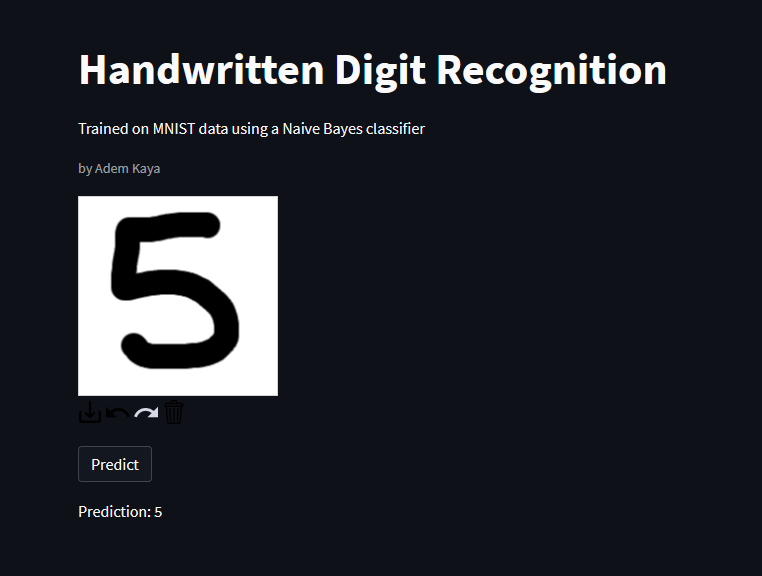

# Handwritten Digit Recognizer in Streamlit

A simple application where the user can draw a digit on a canvas, and a model will try to predict it.

The following screenshot shows the app in action:

The model is a multinomial Naive Bayes classifier trained on the MNIST dataset from sklearn (digits).